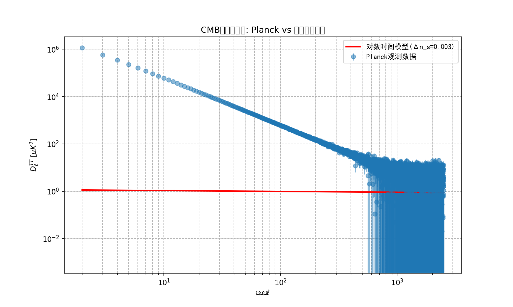

# log_time_model

## Project Overview

This project implements a logarithmic time analysis framework for studying the evolutionary behavior of complex systems. By transforming traditional linear time `t` into logarithmic time `τ = ln(t/t₀)`, we can more effectively observe the dynamic properties of systems across different time scales.

The project mainly includes the following components:
- Logarithmic time transformation and equal-τ resampling methods
- Simulation and analysis of various physical systems (Ising model, quantum Ising model, cellular automata, etc.)
- Processing and analysis of Cosmic Microwave Background (CMB) data
- Unified data visualization and result output system

## Installation Guide

### Dependencies
- Python 3.8+ (Python 3.10+ recommended)
- Required Python libraries:
  ```
  requests>=2.31.0
  pandas>=2.2.2
  numpy>=1.26.4
  matplotlib>=3.8.4
  astropy>=6.0.0
  ```
  Optional dependencies:
  ```
  numba>=0.59.0  # For acceleration
  qutip>=4.7.5   # For quantum system simulation
  ```

### Installation Steps
1. Clone this repository:
   ```bash
   git clone https://github.com/wonderingWu/log_time_model.git
   cd log_time_model/regen_all
   ```
2. Install dependencies:
   ```bash
   pip install -r requirements.txt
   ```

## Usage

### Core Framework
```python
python logtime_minimal_framework.py --all  # Run all examples
```

### System-specific Analysis
```python
# Ising model analysis
python logtime_minimal_framework.py --ising --ising-L 64 --ising-steps 200000 \
       --ising-burn 100000 --ising-thin 200 --n-real 10 --seed 123

# Cellular automata analysis
python logtime_minimal_framework.py --ca --ca-rule 30 110 --ca-size 256 \
       --ca-steps 4000 --ca-window-rows 256 --n-real 8 --seed 42

# Quantum Ising model analysis
python logtime_minimal_framework.py --tfim --tfim-N 8 --tfim-tmax 20 --n-real 10

# Cosmology data analysis
python cosmology_analysis.py --experiment Planck
```

### Data Visualization
```python
# Generate Ising model energy evolution comparison plot
python ising_comparison.py
```

## File Structure

```
regen_all/
├── cosmology_analysis.py   # Cosmology data analysis script
├── ising_comparison.py     # Ising model comparison analysis
├── logtime_minimal_framework.py  # Core logarithmic time framework script
├── out/                    # Output folder
│   ├── ca/                 # Cellular automata results
│   ├── cosmology/          # Cosmology analysis results
│   ├── ising/              # Ising model results
│   └── tfim*/              # Quantum Ising model results
├── README.md               # Project documentation (Chinese)
├── README_EN.md            # Project documentation (English)
└── requirements.txt        # Dependencies list
```

## Features

### Logarithmic Time Framework
- Implements consistent logarithmic time transformation `τ = ln(t/t₀)`
- Supports equal-τ resampling for uniform sampling on logarithmic time scale
- Provides robust parameterized metrics: Total Variation (TV), polyline arc length, curvature integral, etc.
- Supports multiple realizations, random seed control, and confidence interval aggregation

### Ising Model Analysis
- 2D Ising model Monte Carlo simulation
- Supports burn-in, thinning, and multiple realization averaging
- Comparison of energy and variance evolution between linear and logarithmic time
- Automatic generation of comparison plots and data files

### Cosmology Data Analysis
- Supports Planck satellite observation data loading
- Supports simulated data for future experiments like LiteBIRD and CMB-S4
- Provides simulated data as fallback when astropy library is not available
- Generates CMB power spectrum comparison plots

### Cellular Automata Analysis
- Supports Rule 30 and Rule 110 cellular automata
- Bit-packed window implementation for improved computational efficiency
- Integrates LZ78 complexity estimator

## Example Results

### Ising Model Energy Evolution Comparison


### CMB Power Spectrum Comparison


## Notes
- Some features require optional dependencies (e.g., qutip for quantum system simulation)
- Processing large datasets may require significant computation time; please set parameters appropriately
- For changing output paths or other advanced settings, modify the corresponding parts in the source code

## Future Work
- Add support for more physical systems (e.g., XY model, Heisenberg model, etc.)
- Optimize processing efficiency for large datasets
- Implement more complex logarithmic time transformation methods
- Add machine learning-assisted analysis features
